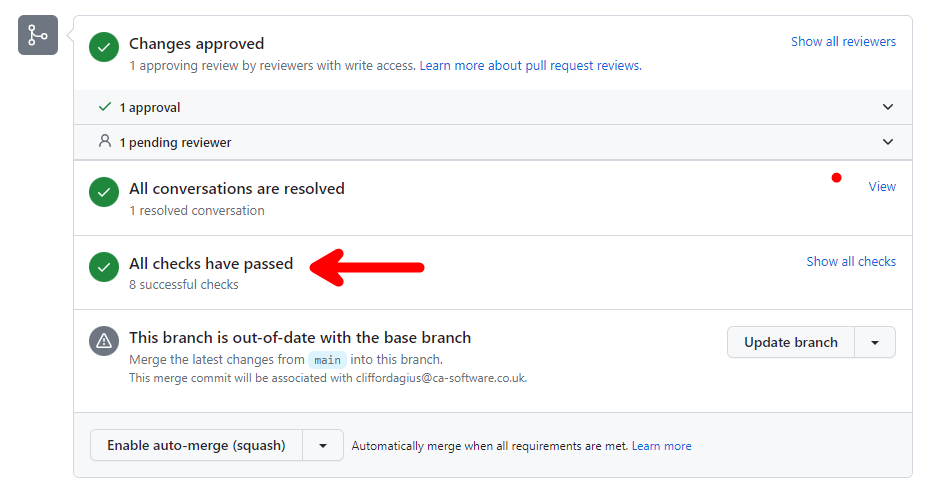
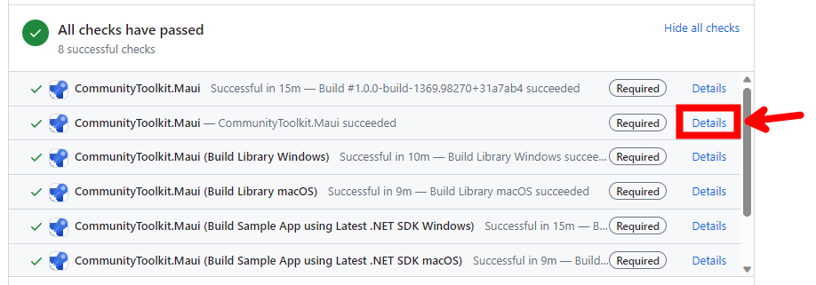

The Community Toolkit has a variety of ways to test out new features or fixes ahead of their official release. This page describes the various channels available and how to connect them to your development environment.

🚨 It's important to note that with any of these previews, there are APIs, controls, or features which may change or be removed before the final release. They are intended to make it easier for developers to provide feedback on them ahead of time so we can gauge interest or ensure they cover a broad range of scenarios before we ship them. Therefore, it's important to not rely on the preview package too heavily or use within production software without understanding these risks.

# 'Official' Preview Packages

As we prepare for an official release, we may release 'official' preview packages to NuGet itself, this allows us to more easily reach a broader audience with a scoped set of updates we want developers to try out before we ship. This allows us to gather feedback and make changes before we 'lock them in' for a release.

To access these previews, you can simply ensure you have the [Include prerelease](https://docs.microsoft.com/nuget/create-packages/prerelease-packages#installing-and-updating-pre-release-packages) checkbox checked in Visual Studio. This will search and display any preview packages in the version dropdown for CommunityToolkit.Maui [[NuGet Packages]]. We typically use the suffix `-preview` for any of these releases.

# Azure Feeds

We have a number of public NuGet feeds hosted from our Azure DevOps pipeline. These are not found by default when searching the main NuGet server from within Visual Studio. You must add alternate [Package sources](https://docs.microsoft.com/nuget/consume-packages/install-use-packages-visual-studio#package-sources) within the Visual Studio settings or if sharing within a team/project setup [packageSources](https://docs.microsoft.com/nuget/reference/nuget-config-file#packagesources) within a `nuget.config` file.

## Latest 🌙

Feed URL: `https://pkgs.dev.azure.com/dotnet/CommunityToolkit/_packaging/CommunityToolkit-MainLatest/nuget/v3/index.json`

The Latest feed is updated whenever a change is merged to the main branch. It contains the latest changes to the next versions of the Community Toolkit. It is a great feed to help test the latest set of features which have gone through the development process and are pending release. (_Note: It is possible new features can still be changed or removed before a release._)

By the way: you can not only find the .NET MAUI Community Toolkit here but also others!

## Pull Requests 🚧

Feed URL: `https://pkgs.dev.azure.com/dotnet/CommunityToolkit/_packaging/CommunityToolkit-PullRequests/nuget/v3/index.json`

🚨 The Pull Request feed is automatically built from PRs that are submitted. They may contain untested features, unreviewed fixes, and code which has not been validated. It is important to understand these risks before pulling a package from the feed.

That said, the Pull Request feed is a great feed to help other developers test and review their features before they are added to the Toolkit.

To find the package for the latest successful build of a PR you are interested in, at the bottom of the PR listing there will be a Checks block.

Expanding this on the right side will show you all the completed check that were made using the code from this PR so you can now select the 'Details' link to be taken to the Azure Pipeline where the PR was built and tested.

To install the package you can use the 'Package Manager Console' command:

    Install-Package C:\{{Folder Location of package}}\CommunityToolkit.Maui.1.0.0-build-XXX.XXXXX.nupkg

This will run the NuGet package manager and install the PR package you need, but please remember that you also need to install the CommunityToolkit.Maui.Core NuGet from the downloaded Zip as well as a minimum and the Maps/MediaElement if the PR is related to these parts of the toolkit.

 To find the appropriate package version, just check for the last successful build of the PR at the bottom of the page in the PR checks. 

You can expand it by clicking on `Show all checks` and then finding the version next to the `CommunityToolkit.Maui` check, as seen here:

